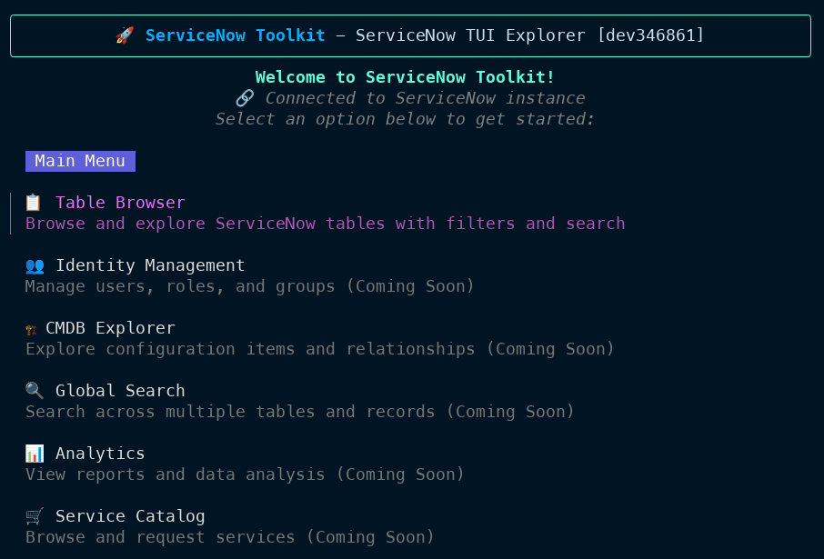

# ServiceNow Toolkit 🚀

<div align="center">

**A comprehensive Go SDK and interactive CLI for ServiceNow**

*Empowering developers with elegant APIs and terminal-based exploration*

[](https://golang.org)
[](https://servicenow.com)

</div>

---

## 🌟 What is ServiceNow Toolkit?

ServiceNow Toolkit is a modern, feature-rich Go SDK and CLI tool that transforms how you interact with ServiceNow. Whether you're building integrations, automating workflows, or exploring data, ServiceNow Toolkit provides the tools you need with an emphasis on developer experience and productivity.



### ✨ **Why ServiceNow Toolkit?**

- **🎯 Developer-First Design** - Intuitive APIs that feel natural to Go developers
- **🖥️ Interactive Terminal UI** - Beautiful TUI for exploring ServiceNow data directly from your terminal
- **🔐 Multi-Auth Support** - API Key, Basic Auth, OAuth 2.0 - all authentication methods supported
- **⚡ High Performance** - Built-in rate limiting, retry logic, and batch operations
- **🛠️ Production Ready** - Context support, error handling, and enterprise-grade reliability
- **📊 Rich Analytics** - Comprehensive aggregation and statistical operations
- **🎨 Extensible** - Clean architecture that's easy to extend and customize

---

## 🚀 Quick Start

### Installation

```bash
# Install the CLI
go install github.com/Krive/ServiceNow-Toolkit/cmd/servicenowtoolkit@latest

# Create a shorter alias (optional)
alias snt=servicenowtoolkit

# Or use as a library in your Go project
go get github.com/Krive/ServiceNow-Toolkit
```

### Environment Variables

Create a `.env` file in the project root:
```env
SERVICENOW_INSTANCE_URL=https://yourinstance.service-now.com
SERVICENOW_USERNAME=yourusername
SERVICENOW_PASSWORD=yourpassword
SERVICENOW_API_KEY=your_api_key
SERVICENOW_CLIENT_ID=your_client_id
SERVICENOW_CLIENT_SECRET=your_client_secret
```

### 30-Second Demo

```go
package main

import (
    "fmt"
    "log"
    "github.com/Krive/ServiceNow-Toolkit/pkg/servicenow"
    "github.com/Krive/ServiceNow-Toolkit/pkg/servicenow/query"
)

func main() {
    // Connect to ServiceNow
    client, err := servicenow.NewClientAPIKey(
        "https://yourinstance.service-now.com",
        "your-api-key",
    )
    if err != nil {
        log.Fatal(err)
    }

    // Query high-priority incidents
    incidents, err := client.Table("incident").
        Where("priority", query.OpEquals, "1").
        Where("state", query.OpEquals, "1").
        OrderByDesc("sys_created_on").
        Limit(10).
        Execute()

    if err != nil {
        log.Fatal(err)
    }

    fmt.Printf("Found %d critical incidents\n", len(incidents))
    for _, incident := range incidents {
        fmt.Printf("• %s: %s\n",
            incident["number"],
            incident["short_description"])
    }
}
```

### Interactive Explorer

Launch the beautiful terminal UI to explore your ServiceNow instance:

```bash
# Launch interactive explorer
servicenowtoolkit explorer --api-key "your-key" --instance "https://your-instance.service-now.com"

# Or use demo mode to see the interface
servicenowtoolkit explorer --demo
```

---

## 🎯 Core Features

### 📋 **Complete Table Operations**
- Full CRUD operations with intuitive APIs
- Advanced query builder with complex conditions
- Bulk operations for high-performance data processing
- Custom field support for extended ServiceNow configurations

### 👥 **Identity & Access Management**
- User, role, and group management
- Access control validation and reporting
- Session management and authentication tracking
- Comprehensive permission analysis

### 🏗️ **CMDB Integration**
- Configuration item management
- Relationship mapping and dependency tracking
- Class hierarchy exploration
- Automated discovery data handling

### 📊 **Analytics & Aggregation**
- Statistical operations (count, sum, avg, std dev)
- Multi-dimensional grouping and analysis
- Custom metrics and KPI calculations
- Real-time data insights

### 🛒 **Service Catalog Management**
- Catalog browsing and item discovery
- Variable validation and price estimation
- Cart management and order processing
- Request tracking and workflow monitoring

### 🔐 **Enterprise Authentication**
- API Key authentication (recommended)
- Basic username/password authentication
- OAuth 2.0 client credentials flow
- OAuth authorization code with refresh tokens

### ⚡ **Performance & Reliability**
- Intelligent rate limiting with burst capacity
- Exponential backoff retry mechanisms
- Context-aware timeouts and cancellation
- Connection pooling and keep-alive

---

## 🖥️ Interactive Terminal UI

ServiceNow Toolkit includes a stunning terminal user interface that brings ServiceNow exploration to your command line:

### **TUI Features:**
- **Table Browser** - Interactive data exploration with filtering
- **Identity Browser** - User, role, and group management interface
- **CMDB Explorer** - Configuration item relationship mapping
- **Global Search** - Cross-table search capabilities
- **Real-time Updates** - Live data refresh and monitoring
- **Keyboard Navigation** - Vim-like shortcuts for power users

---

## 📖 Documentation

### 🚀 **Getting Started**
- [Installation Guide](docs/getting-started.md) - Set up ServiceNow Toolkit in minutes
- [Authentication Guide](docs/authentication.md) - Configure secure connections
- [Quick Start Tutorial](docs/getting-started.md#quick-start) - Your first ServiceNow Toolkit application

### 📚 **API Reference**
- [Table Operations](docs/table-api.md) - Complete CRUD operations guide
- [Query Builder](docs/table-api.md#advanced-querying) - Complex query construction
- [Batch Operations](docs/batch_api.md) - High-performance bulk processing
- [Aggregation API](docs/aggregate_api.md) - Statistical analysis and reporting
- [Service Catalog](docs/catalog_api.md) - Catalog integration and automation
- [Core API Reference](docs/api-reference.md) - Complete SDK documentation

### 🛠️ **Advanced Topics**
- [Rate Limiting](docs/api-reference.md#rate-limiting) - Performance optimization
- [Error Handling](docs/api-reference.md#error-handling) - Robust error management
- [Context & Timeouts](docs/api-reference.md#context-support) - Cancellation patterns
- [Custom Fields](docs/api-reference.md#custom-fields) - Extended ServiceNow schemas

---

## 🔧 Examples

Explore real-world usage patterns:

```bash
# View all available examples
ls examples/

# Key examples to get started:
examples/
├── basic_auth/          # Basic authentication setup
├── api_key/            # API key authentication
├── oauth_refresh/      # OAuth with refresh tokens
├── table_operations/   # CRUD operations
├── advanced_queries/   # Complex query patterns
├── batch/             # Bulk operations
├── aggregate/         # Statistical analysis
├── catalog/           # Service catalog integration
└── attachments/       # File upload/download
```

---

## 🚀 CLI Commands

ServiceNow Toolkit provides a comprehensive command-line interface:

```bash
# Table operations
servicenowtoolkit table incident list --limit 10
servicenowtoolkit table incident get INC0000123
servicenowtoolkit table incident create --data '{"short_description":"Test incident"}'

# Identity management
servicenowtoolkit identity users list --active
servicenowtoolkit identity roles list --elevated
servicenowtoolkit identity groups list --type "itil"

# CMDB operations
servicenowtoolkit cmdb list --class "cmdb_ci_server"
servicenowtoolkit cmdb relationships --ci "server123"

# Batch operations
servicenowtoolkit batch create incident --file incidents.json
servicenowtoolkit batch update incident --file updates.json

# Service catalog
servicenowtoolkit catalog items list --category "hardware"
servicenowtoolkit catalog order --item "laptop_request" --quantity 1

# Analytics and aggregation
servicenowtoolkit aggregate incident --group-by state --count
servicenowtoolkit aggregate incident --metrics "avg:priority,sum:impact"

# Interactive explorer
servicenowtoolkit explorer --demo                    # Demo mode
servicenowtoolkit explorer --api-key "your-key"     # Live connection
```

---

## 🛡️ Security & Best Practices

ServiceNow Toolkit is built with security and enterprise needs in mind:

### **Authentication Priority**
1. **API Key** (recommended) - Secure, rotatable, scoped access
2. **Basic Auth** - Simple username/password for development
3. **OAuth Client Credentials** - Service-to-service authentication
4. **OAuth Authorization Code** - User-delegated access

### **Security Features**
- Secure credential storage and management
- Automatic token refresh and rotation
- Rate limiting to prevent abuse
- Context-aware timeout handling
- Comprehensive audit logging

---

## 📈 Roadmap

Exciting features coming soon:

- **🔄 Real-time Data Streaming** - Live updates and change notifications
- **🧪 Advanced Testing Tools** - ServiceNow instance testing and validation
- **📱 REST API Gateway** - Transform ServiceNow Toolkit into a microservice
- **🔌 Plugin Architecture** - Extensible modules for custom functionality
- **📊 Advanced Analytics** - Machine learning insights and predictions
- **🌐 Multi-Instance Management** - Manage multiple ServiceNow environments

View our complete [roadmap](docs/roadmap.md) for more details.

---

## 📄 License

---

## 🙏 Acknowledgments

ServiceNow Toolkit is built with excellent open-source libraries:

- **[Cobra](https://github.com/spf13/cobra)** - Powerful CLI framework
- **[Bubbletea](https://github.com/charmbracelet/bubbletea)** - Beautiful terminal UIs
- **[Lipgloss](https://github.com/charmbracelet/lipgloss)** - Terminal styling
- **[Resty](https://github.com/go-resty/resty)** - HTTP client library

---

<div align="center">

**⭐ Star this project if you find it useful!**

**🐛 Found an issue? [Report it here](https://github.com/Krive/ServiceNow-Toolkit/issues)**

**💬 Questions? [Start a discussion](https://github.com/Krive/ServiceNow-Toolkit/discussions)**

---


</div>
